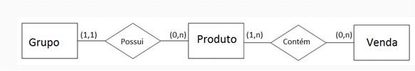

### O que é banco de dados?
Um banco de dados é uma coleção estruturada e organizada de informações inter-relacionadas, armazenada de forma segura em um computador. Para que ele funcione é necessário um SGBD (Sistema Gerenciador de Banco de Dados), que é um programa que permite criar, gerenciar e acessar o banco de dados.
O SGBD mais conhecido é o MySQL, mas também há outros como:
* PostgreSQL
* SQL Server
* Oracle

### Modelo de Entidade-Relacionamento
Em um projeto de banco de dados, o Modelo de Entidade-Relacionamento (MER) é o "mapa" que define como as informações estão organizadas e conectadas entre si. Ele é usado para projetar a estrutura do banco de dados antes de criar as tabelas e é composto por três elementos principais:
- Entidades (Tabelas): Objetos da vida real sobre os quais queremos guardar dados (ex: Cliente, Produto).
    - Entidades fortes são independentes, não dependem de outra entidade para existir.
    - Entidades fracas são dependentes, só existe se tiver uma entidade forte ligada a ela.
- Atributos (Colunas): As características de cada entidade (ex: Nome do Cliente, Preço do Produto).
    - Atributos simples são informações que não podem ser divididas.
    - Atributos compostos são informações que podem ser divididas em várias partes.
    - Atributos multivalorados são informações que podem ter vários valores.
    - Atributos chave são informações que identificam uma entidade.
- Relacionamento: Como as entidades interagem entre si (ex: Cliente compra Produto)
    - Relacionamentos simples são relacionamentos entre duas entidades.
    - Relacionamentos ternários são relacionamentos entre três entidades.
- Cardinalidade: Define quantos registros de uma entidade podem se relacionar com registros de outra entidade.
    - Um para um (1:1): Um registro de uma entidade pode se relacionar com apenas um registro de outra entidade.
    - Um para muitos (1:N): Um registro de uma entidade pode se relacionar com vários registros de outra entidade.
    - Muitos para muitos (N:N): Vários registros de uma entidade podem se relacionar com vários registros de outra entidade.

### Diagrama de entidade-relacionamento
O diagrama de entidade-relacionamento é uma ferramenta visual que ajuda a entender como as informações estão organizadas e conectadas entre si. Ele representa as entidades (as "coisas" que você quer guardar, como clientes, produtos, pedidos) e os relacionamentos (como elas se conectam).

No DER usamos:
- Entidades como retângulos.
- Atributos como elipses.
- Relacionamentos como losangos.

## Formas Normais
As formas normais são regras que estabelecem padrões para o design de bancos de dados relacionais, visando minimizar a redundância de dados e evitar anomalias (inconsistências que podem ocorrer durante inserções, atualizações ou exclusões de dados).

### 1ª Regra: Cada espaço tem apenas uma informação (Primeira Forma Normal - 1FN - Valores Atômicos)
Cada coluna deve ter apenas um valor. Se o cliente tem dois telefones, você deve ter uma forma de registrar isso separadamente (por exemplo, criando uma tabela só para guardar telefones vinculados àquele cliente) em vez de jogar tudo na mesma linha. Tudo precisa ser "atômico" (não pode ser dividido).

### 2ª Regra: Tudo na tabela deve depender da "chave" principal (Segunda Forma Normal - 2FN - Sem dependência parcial)
Imagine uma tabela de "Itens do Pedido", onde a chave primária seja composta pelo Código do Pedido + Código do Produto. Se nessa mesma tabela você colocar o "Nome do Produto", você está quebrando a regra! O nome do produto depende apenas do Produto, e não do Pedido em si.
O que fazer? Tire o "Nome do Produto" dali e crie uma tabela separada só de "Produtos". Na tabela do pedido, você guarda apenas o código dele.

Se a sua tabela tem uma chave composta (formada por mais de uma coluna), as outras colunas devem depender da chave como um todo, não de apenas uma parte dela.

### 3ª Regra: Nada de "caronas" ou informações indiretas (Terceira Forma Normal - 3FN - Sem dependência transitiva)
Imagine que você tem uma tabela de "Funcionários" e, junto com o código do departamento, você resolve colocar o "Nome do Departamento" nessa tabela. Se o nome do departamento mudar, você terá que atualizar em todas as linhas de funcionários daquele departamento. Isso é ruim!
O que fazer? Crie uma tabela separada para "Departamentos" e guarde apenas o código dele na tabela de "Funcionários".

### Resumo da Ópera:

1. Não coloque várias coisas no mesmo quadradinho (sem listas num campo só).
2. Cada tabela só deve falar sobre um assunto principal. Se a tabela é de Pedido, não fale das características do Produto nela.
3. Não guarde informações que podem ser descobertas através de outras informações (se você já tem o CEP na tabela, não precisa escrever a cidade e estado na mesma tabela).

Aplicando essas 3 regrinhas, o seu banco de dados fica organizado, rápido de consultar e muito mais seguro contra erros de digitação e informações desatualizadas!