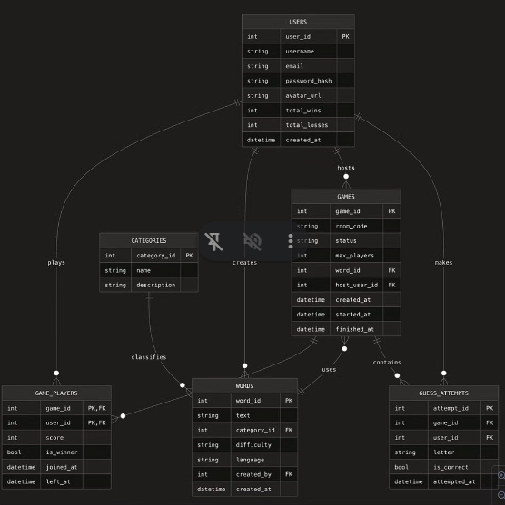

### Projeto Grupo 2
## 1. Introdução
Nesse a gente precisa desenvolver uma aplicação simples pra aplicar os conhecimentos adquiridos, incluindo banco de dados.

**Exemplo**: Um jogo da forca.

### 1. Resumo
- Jogo da forca multiplayer online
- Backend com Flask (SQLAlchemy) + Socket.IO, com divisão de responsabilidades clara

### 2. Funcionalidades
- Autenticação (register / login) + JWT
- Cadastro de palavras (CRUD)
- Salas (criação / entrada por código)
- Jogo multiplayer 1-vs-1 (em tempo real)
- Tabela de placar geral

### 3. Responsabilidades

#### Person 1 — Data & Auth (Backend core)
- SQL Server schema/migrations, SQLAlchemy models, Marshmallow schemas
- Auth (register/login/JWT)
- CRUD endpoints for Users and Words

#### Person 2 — Multiplayer/Game Engine (Backend real-time)
- Flask-SocketIO: room creation, join/leave, turn order
- Game state machine (waiting → in_progress → finished)
- Guess validation, win/loss conditions, writes to GAME_PLAYERS / GUESS_ATTEMPTS

#### Person 3 — Frontend integration (extends existing vanilla JS)
- Add a lobby screen to the existing UI: username entry, create/join room by code
- Live opponent status (whose turn, remaining lives) rendered alongside the current hangman board
- Wire up fetch calls for REST endpoints + socket.io-client (CDN, no build step needed) for real-time events
- Builds against mocked JSON responses and fake socket events matching the agreed contract — no need to wait for Person 1 or 2's actual server

### integrantes
- Samara
- Barbara
- Jéssica

### Repositório
[Repositório do projeto](https://github.com/barbaramazevedo/Hangman-Game)